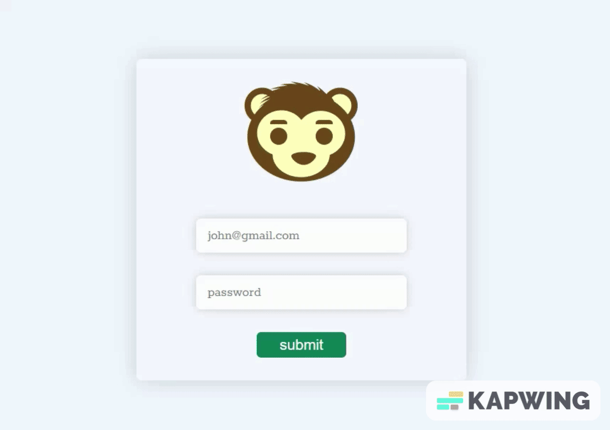
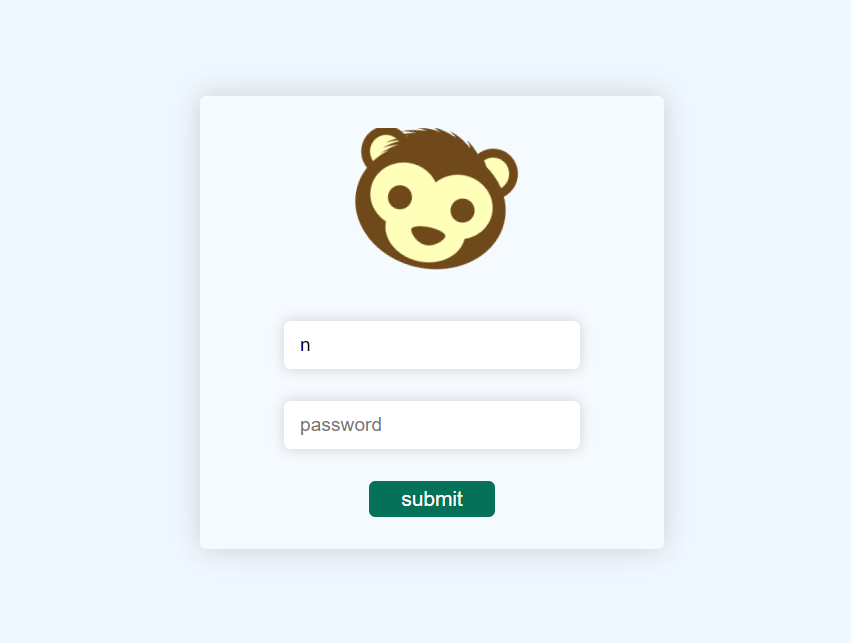
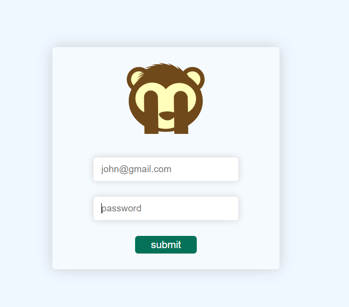

# Interactive-monkey-login-form
Interactive-monkey-login-form responsive for all devices.
## tools and technologies used

### How it work
when user enter the email the monkey rotate his face and follow the user steps.
when user enter the password then monkey cover his eyes with his hand that's look so impressive.

[visit now](https://nidhisharma63.github.io/monkey-interactive-login-from/)

## here it's

 

### [visit now](https://nidhisharma63.github.io/monkey-interactive-login-from/).

